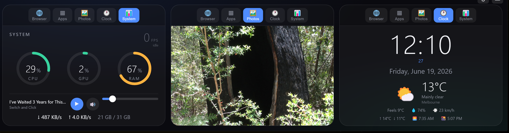

# iPad Dock

A sleek, always-on-top **control deck** for a second display — built for an iPad Pro 12.9" used as an
extended monitor on Windows 11, docked along the bottom strip of the screen.



It's a frameless [Electron](https://www.electronjs.org/) bar split into **three interchangeable slots**.
Tap the switcher at the top of any slot to change what it shows.

---

## ✨ Features

| Tile | What it does |
|------|--------------|
| 🌐 **Browser** | Embedded web view with back/forward/reload, an address bar, and quick links. Remembers its last URL per slot. |
| ▦ **App launcher** | Touch grid of your apps with real icons — one tap to launch (Steam, Chrome, Discord, VS Code, …). |
| 🖼️ **Photo frame** | Cross-fading slideshow from any folder, **recursive** (includes subfolders), shuffle, tap-to-skip. |
| 🕐 **Clock + Weather** | Big clock, date, and live weather via [Open-Meteo](https://open-meteo.com) (no API key). |
| 📊 **System monitor** | CPU / GPU / RAM / Battery ring gauges, live network throughput, and real **game FPS**. |

- **Scales to any height** — text and gauges resize so it looks right whether the bar is short or tall.
- **Remembers its place** — drag/resize once; it restores on every launch and survives slot changes.
- **Auto-starts at login**, lives in the system tray (click the tray icon to show/hide), zero taskbar clutter.

---

## 🖥️ Requirements

- **Windows 10/11**
- **[Node.js](https://nodejs.org)** (built with v24) — dev/run-from-source workflow
- **Electron 43** (installed by `npm install`)
- An NVIDIA GPU for full GPU telemetry via `nvidia-smi` (other GPUs fall back to limited stats)

## 🚀 Getting started

```bash
git clone https://github.com/netgnus/Corsair-app.git
cd Corsair-app
npm install
npm start
```

Or on Windows, just double-click **`start.bat`** (installs dependencies on first run).

### Make it launch silently + at login
Run **`make-shortcuts.ps1`** once — it generates the icon and creates Desktop + Startup shortcuts that
launch the dock with no console window.

---

## 🎮 Game FPS (optional)

Real foreground-game FPS is measured with [PresentMon](https://github.com/GameTechDev/PresentMon)
(bundled in `tools/`, MIT-licensed). Because it uses ETW, it needs admin:

```powershell
# run once — self-elevates and registers an at-login scheduled task
powershell -ExecutionPolicy Bypass -File setup-fps.ps1
```

A small helper (`fps-monitor.js`) runs PresentMon and writes the current FPS to `fps-data.json`, which the
dock reads. FPS shows while a game is presenting; the desktop reads "idle".

## 🎛️ Controls

- **Top drag bar** — move the window. **⚙** settings, **—** minimize.
- **Tray icon** (Windows system tray) — click to show/hide; right-click for:
  - **Dock on display** — Auto (external/iPad) or a specific screen
  - **Bar height** — 240–520 px
  - **Re-snap to bottom**, **Show / Restore dock**, **Open settings**, **Reload**, **Quit**
- **Settings (⚙)** — photo folder, shuffle, slideshow interval, weather units (°C/°F), manual lat/lon.

## ⚙️ Configuration

Settings persist to `%APPDATA%\ipad-dock\config.json` (slot choices, per-slot browser URLs, photo
folder, weather, bar height, chosen display, window position). Delete it to reset to defaults.

Since v1.2.0 the file carries a **schema version** (`configVersion: 2`). Older (v1.1.0) configs are
migrated automatically on first launch. Every field is validated with safe fallbacks — a corrupted
or hand-edited value can degrade one setting, never crash the app. Writes are **debounced and
atomic** (temp file + rename), and flushed on shutdown.

The app-launcher list is built by **`resolve-apps.ps1`** — edit its `$wanted` list and re-run it to
change which apps appear (it re-extracts icons into `icons/` and rewrites `apps.json`).

## 🏗️ Architecture (v1.2.0)

**Main process** (`src/main/`) owns every OS interaction; the sandboxed renderer only draws.

```
ipad-dock/
├── main.js                 # entry: dock UI, or --fps-helper headless mode
├── preload.js              # the only bridge (contextBridge, thin + explicit)
├── src/main/
│   ├── app.js              # lifecycle: single instance, startup order, shutdown
│   ├── config.js           # schema v2, migration, validation, atomic saves
│   ├── window.js           # frameless window, placement, remembered bounds
│   ├── tray.js             # tray icon/menu (rebuilt only on display/height changes)
│   ├── security.js         # sandbox rules, webview lockdown, popups, permissions
│   ├── telemetry.js        # persistent helpers + watchdogs + health
│   ├── weather.js          # Open-Meteo, cached in main (10 min TTL)
│   ├── photos.js           # async time-bounded recursive scan + cache
│   ├── launcher.js         # ID-based app launching (no renderer paths)
│   ├── audio.js            # user-triggered volume / media-key one-shots
│   └── ipc.js              # all handlers, sender-validated
├── renderer/
│   ├── index.html          # CSP-protected shell
│   ├── store.js            # ONE shared poll/subscribe layer for all widgets
│   ├── slots.js            # slot manager + widget lifecycle (pause/resume)
│   ├── settings.js         # settings overlay + Dock Health panel
│   ├── app.js              # bootstrap
│   └── widgets/            # browser, clock, system, photos, launcher
├── stats-loop.ps1          # persistent net+media stream (bounded WinRT waits)
├── fps-monitor.js          # PresentMon wrapper (ownership-aware, atomic writes)
└── tools/PresentMon.exe    # bundled FPS capture (MIT)
```

### Telemetry (the golden rule)

**Nothing spawns a process per poll.** One persistent `stats-loop.ps1` streams network + media;
one persistent `nvidia-smi -l 5` streams GPU; CPU/RAM are native in-process reads; battery is
checked once (desktops never again). A **watchdog** restarts any helper that dies — or that is
alive but silent for >12 s — with backoff, and counts restarts. Orphan helpers from a force-killed
previous run are cleaned at startup (ownership-checked; nothing unrelated is ever touched).

In the renderer, one shared store polls each topic once no matter how many widgets display it —
`System | System | System` still causes a single stats cycle — and all polling pauses while the
dock is hidden.

### Security

- Renderer runs with `contextIsolation`, `sandbox: true`, no Node.
- The Browser widget's `<webview>` guests are forced sandboxed with no preload/Node; only http(s)
  loads; popups never create windows (http(s) popups are handled by the controlled
  window-open handler; everything else is dropped).
- Device permissions (camera, mic, geolocation, notifications, MIDI, clipboard, …) are **denied by
  default** for all remote content; only fullscreen is allowed.
- The local UI has a strict CSP and can never navigate away from its own page.
- IPC is sender-validated; `set-config` accepts only whitelisted, validated fields; the launcher
  uses opaque IDs — the renderer can never supply a filesystem path.

### Dock Health

Settings (⚙) includes a live **Dock Health** panel: helper status + data age, restart counts,
PresentMon/FPS state, weather cache age, photo count/scan state, and the active network interface.

### Packaging notes

`main.js` supports `--fps-helper`: the packaged app can run its own FPS monitor
(`iPadDock.exe --fps-helper`) so a machine without Node keeps FPS functionality. In development,
`node fps-monitor.js` still works and the existing scheduled task is unchanged.

## 📜 Changelog

### v1.2.0 — hardening & architecture (2026-08)
- Electron 33 → **43**
- Renderer sandboxed; webview guests locked down; `allowpopups` removed; deny-by-default
  permissions; CSP on the local UI
- IPC hardened: sender validation, whitelisted+validated `set-config`, ID-based app launcher
- Config schema v2 with automatic migration, full validation, atomic debounced writes
- Helper **watchdogs** (restart on death *or* silence) + startup orphan cleanup + health tracking
- `stats-loop.ps1`: bounded WinRT waits (no more infinite media hangs), media manager reuse with
  self-healing backoff, **default-route** network adapter selection
- PresentMon cleanup is ownership-aware (never kills unrelated instances); `fps.json` writes atomic
- Renderer: shared telemetry store (no multiplied polling), widget pause/resume lifecycle,
  modular codebase, **Dock Health** diagnostics panel
- `--fps-helper` mode for future Node-free packaging

### v1.1.0 — performance (2026-08)
- Eliminated per-poll process spawning (~150/min → 0): persistent helper streams; CPU ~60% → <1%

### v1.0.0 — first release (2026-06)
- Three switchable slots; Browser, Apps, Photos, Clock+Weather, System widgets

## 🙏 Credits

- [Electron](https://www.electronjs.org/) · [systeminformation](https://systeminformation.io/)
- [PresentMon](https://github.com/GameTechDev/PresentMon) (Intel/GameTechDev, MIT)
- [Open-Meteo](https://open-meteo.com) weather API

## 📄 License

MIT — see [LICENSE](LICENSE).
